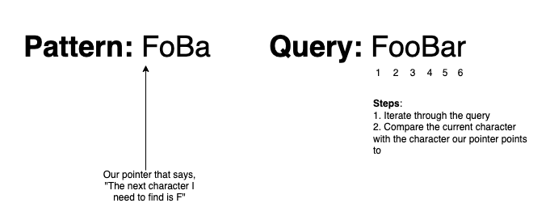

# Leetcode #1023. Camelcase Matching

## Background and Problem Statement

In this guide, we'll walk through an interesting LeetCode problem in Python. Here is the problem we are given:

> A query word matches a given pattern if we can insert lowercase letters to the pattern word so that it equals the query. (We may insert each character at any position, and may insert 0 characters.)
>
> Given a list of queries, and a pattern, return an answer list of booleans, where answer[i] is true if and only if queries[i] matches the pattern.

**Example 1:**

> **Input:** queries = ["FooBar","FooBarTest","FootBall","FrameBuffer","ForceFeedBack"], pattern = "FB"
>
> **Output:** [true,false,true,true,false]
>
> **Explanation:**
>
> "FooBar" can be generated like this "F" + "oo" + "B" + "ar".
>
> "FootBall" can be generated like this "F" + "oot" + "B" + "all".
>
> "FrameBuffer" can be generated like this "F" + "rame" + "B" + "uffer".

**Example 2:**

> **Input:** queries = ["FooBar","FooBarTest","FootBall","FrameBuffer","ForceFeedBack"], pattern = "FoBa"
>
> **Output:** [true,false,true,false,false]
>
> **Explanation:**
>
> "FooBar" can be generated like this "Fo" + "o" + "Ba" + "r".
>
> "FootBall" can be generated like this "Fo" + "ot" + "Ba" + "ll".

**Example 3:**

> **Input:** queries = ["FooBar","FooBarTest","FootBall","FrameBuffer","ForceFeedBack"], pattern = "FoBaT"
>
> **Output:** [false,true,false,false,false]
>
> **Explanation:**
>
> "FooBarTest" can be generated like this "Fo" + "o" + "Ba" + "r" + "T" + "est".

We'll tackle this problem by first building up an intuition for a solution, then translating that intuition into code. Then we'll explore the runtime and space complexity of our solution. Let's get started!

## Intuition

This looks like a tough problem, but let's break it down into smaller pieces. As a first step, we'll take a few queries that either match or violate our pattern, and explicitly state _why_ they match or violate.

---

### Example 1

**Query**: "FooBar"

**Pattern**: "FoBa"

**Result**: True

**Analysis**: In this fairly simple example, we can break apart "FooBar" into "**Fo**" + "o" + "**Ba**" + "r". The query matches the pattern because the query contains the pattern, "FoBa". Not only does the query contain all the characters in "FoBa", but it also **preserves the order of the characters.** The remaining characters in the query, "o" and "r", are just extra lowercase characters sprinkled within.

---

### Example 2

**Query**: "FooBar"

**Pattern**: "FoBaT"

**Result**: False

**Analysis**: We can see in this example that our query, "FooBar", is missing one of the capital letters in the pattern, "T". To be a match, the query would need the characters "F", "o", "B", "a", and "T" in the correct order and casing, possibly with lowercase letters sprinkled throughout.

---

### Example 3

**Query**: "ForceFeedBack"

**Pattern**: "FoBa"

**Result**: False

**Analysis**: In this example, in contrast to Example 2, we **do** see all the characters in our pattern in order and with the correct casing. However, our query fails to match because we have an unexpected uppercase character, the second "F". We can conclude here that if the query contains an unexpected uppercase character, then the query cannot possibly match the pattern.

---

From these examples, we can see there's really just 2 primary cases that lead to a pattern violation:

1. The query does not contain the pattern's characters (both in **casing and ordering**)
2. The query contains an unexpected uppercase character

Now if you look at violation 1, you will notice that by looking at each character of a query word from left-to-right, by the time we reach the end of the string we'll know whether there's a violation.

Additionally, if you look at violation 2, you will notice similarly that we can also detect this violation by looking at each character of a query word from left to right!

Therefore, one possible solution would involve processing a query word character-by-character, and determining whether a violation occured. If no violation is found, then the query is valid!

This approach looks like it will work, so let's now implement it in Python.

## Code

Here is the base code that we're provided:

```Python
class Solution:
    def camelMatch(self, queries: List[str], pattern: str) -> List[bool]:

```

First of all, notice the input and output stated in the problem. We are given a _list_ of query strings, and we must return a list of booleans. Each boolean indicates whether the query string at the corresponding index of the input list is a matching query.

For simplicity's sake, it will be easier if we focus on a function that operates on just a single query and pattern. Then, we can apply that function to each query in the given `queries` list. Let's write the skeleton for this function and apply it to the entire `queries` list:

```Python
class Solution:
    def camelMatch(self, queries: List[str], pattern: str) -> List[bool]:
        return [self.camelMatchQuery(query, pattern) for query in queries]

    def camelMatchQuery(self, query, pattern):
        # TODO: implement me!

```

Here, we define a helper function `camelMatchQuery` that operates on a single query and pattern. Then, we use a Python [list comprehension](https://docs.python.org/3/tutorial/datastructures.html#list-comprehensions) to apply the function to all queries.

---

Now let's focus on the meat of our algorithm: `camelMatchQuery`. As we mentioned in our intuition, we will iterate through the query string from left to right. By the time we reach the end, we will know whether the query matches the pattern:

```Python
class Solution:
    def camelMatch(self, queries: List[str], pattern: str) -> List[bool]:
        return [self.camelMatchQuery(query, pattern) for query in queries]

    def camelMatchQuery(self, query, pattern):

        # New code here!
        for char in query:
            # TODO: detect some violations!
```

Okay, now that we have some base code setup out of the way, let's think about that first violation we mentioned above:

> "The query does not contain the pattern's characters (both in casing and ordering)".

How do we make sure that the pattern appears in the correct order? One idea is to use a pointer to keep track of which character in our `pattern` we must encounter next in the `query`. This will tell us what character we need to see in our `query` **before** the remaining characters in the `pattern`.



While iterating through our `query`, when we find a character that matches our next required `pattern` character, then we have partially matched the pattern! We can then increment the pointer to the next character in our `pattern`, so that we can match the rest of the pattern:

```Python
class Solution:
    def camelMatch(self, queries: List[str], pattern: str) -> List[bool]:
        return [self.camelMatchQuery(query, pattern) for query in queries]

    def camelMatchQuery(self, query, pattern):
        # New code here! Setting the pointer to start at the first index
        # of the pattern
        patternPointer = 0

        for char in query:

            # New code here! If the current character matches the current pattern
            # character, then we can advance the pattern pointer
            if char == pattern[patternPointer]:
                patternPointer += 1
                continue

```

Great! Now how do we detect a violation? If we finish iterating through `query` and still have characters in `pattern` that need matching, then we know the pattern was fully matched. Let's add some logic for this violation detection:

```Python
class Solution:
    def camelMatch(self, queries: List[str], pattern: str) -> List[bool]:
        return [self.camelMatchQuery(query, pattern) for query in queries]

    def camelMatchQuery(self, query, pattern):
        patternPointer = 0

        for char in query:

            if char == pattern[patternPointer]:
                patternPointer += 1
                continue

        # New code here! If our pointer hasn't processed the entire pattern,
        # then we know the query didn't fully match the pattern
        return patternPointer >= len(pattern)


```

And there we go! We just wrote logic to detect the first violation we discussed in the Intuition section. Now, there's just one more violation to go. Let's tackle that second one:

> The query contains an unexpected uppercase character

For this one, we don't need to add much complex logic. If we encounter an uppercase letter in our query, then we know that this character **must** match the character our `pattern` pointer is pointing to. In our code, after our existing equality check between the current `query` character and `pattern` character, let's make sure the `query` character isn't uppercase:

```Python
class Solution:
    def camelMatch(self, queries: List[str], pattern: str) -> List[bool]:
        return [self.camelMatchQuery(query, pattern) for query in queries]

    def camelMatchQuery(self, query, pattern):
        patternPointer = 0

        for char in query:

            if char == pattern[patternPointer]:
                patternPointer += 1
                continue

            # New code here! After we know the current character is not equal to
            # the next pattern character, we must make sure the current character
            # isn't uppercase
            if char.isupper():
                return False
        return patternPointer >= len(pattern)

```

And there we go! We have an (almost) finished algorithm. There's just one edge case left to cover: What happens if our `pattern` is fully matched, but there are still characters in our `query` that we need to process? In this case, our pointer has nothing to point to, since we matched the entire pattern! As long as those remaining characters contain no uppercase, then the pattern will still be matched. We just need to add some simple edge case logic to capture this:

```Python
class Solution:
    def camelMatch(self, queries: List[str], pattern: str) -> List[bool]:
        return [self.camelMatchQuery(query, pattern) for query in queries]

    def camelMatchQuery(self, query, pattern):
        patternPointer = 0

        # New code here! Handle the case where the pattern pointer passes
        # the length of the pattern
        for char in query:
            if patternPointer >= len(pattern):
                if char.isupper():
                    return False
                continue

            if char == pattern[patternPointer]:
                patternPointer += 1
                continue

            if char.isupper():
                return False
        return patternPointer >= len(pattern)


```

Now, our algorithm is complete!

## Time and Space Complexity

Let's wrap up with an analysis of the time and space complexity of our solution.

In terms of time, we iterate through the `query` string once in order to detect a violation in pattern matching. Once we reach the end of the `query` string, we will have determined whether the `query` matches the `pattern`, so we do not need to iterate through the string again. If we let `n` refer to the size of the `query`, then deciding if a `query` matches a `pattern` requires `O(n)` time. Since we are given an array of `k` `queries` and not just a single query, our overall time complexity is `O(k*n)`, if the queries are roughly the same length.

Now in terms of space, for each time that we validate whether a `query` matches a `pattern`, we only use a constant amount of space to iterate through the `query` and manage our pointer. Therefore, each call to `camelMatchQuery` requires `O(1)` space. Since we need to return an array of booleans for each of the `k` `queries`, our total space complexity becomes `O(k)`, since we need to construct this array before returning it.
